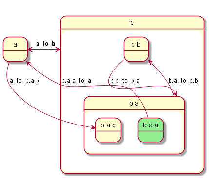
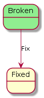

# hsm-java-plantuml - Generates Diagrams from a Java Coded Hierarchical State Machine

Generates [PlantUML](https://plantuml.com/) text from a [hsm-java](https://github.com/artcom/hsm-java)-like state machine which is easily rendered to an image:

## How to use it

Given a [hsm-java](https://github.com/tekkies/hsm-java) ([forked](https://github.com/tekkies/hsm-java)) state machine:

    State broken = new State("Broken");
    State fixed = new State("Fixed");
    broken.addHandler("Fix", fixed, TransitionKind.External);
    StateMachine stateMachine = new StateMachine(broken, fixed);
    stateMachine.init();

PlantUmlBuilder can generate plantuml code

    String plantUml = new PlantUmlBuilder(stateMachine)
        .highlightActiveState()
        .build();

e.g.

    @startuml
    state "Fixed" as Fixed  {
    }
    state "Broken" as Broken #LightGreen {
    }
    Broken --> Fixed : Fix
    @enduml

Which can be rendered by [PlantUML](https://plantuml.com/) (e.g. using [plantext.com](plantext.com)) to convert PlantUML text to a diagram, e.g.

